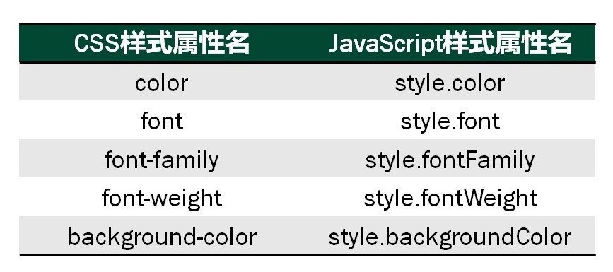

# web 二

### 课前导入

### 关于课程

- 课程体系
	- web开发一：HTML、CSS
	- web开发二：JavaScript、jQuery
	- HTML5、CSS3、前端框架...

- 本门课的内容

- 本门课的作用

- 课程考核

## 1-1 JavaScript概述

#### JavaScript简介

#### JavaScript优缺点

#### JavaScript基本用法

- 使用共有两种方式：内部JavaScript代码、外部JavaScript文件
- 开发工具：浏览器、Sublime Text

***

## 1-2 JavaScript 基础语法

回顾语法特点

- 类 C 语言；
- 弱类型：变量的数据类型可以任意转换；
- 动态类型：变量创建时不用指定数据类型；

#### JavaScript 基础语法

- JS 语句
- JS 语句块
- JS 注释

#### JavaScript 变量及原始数据类型

- 变量的创建和说明
- 原始数据类型
- 运算符
- 数据类型转换

#### JavaScript 流程控制结构

- 选择与分支语句
- 循环语句

#### JavaScript 的基本代码规范

- 代码规范的重要性
- JavaScript 基本规范

#### 调试工具的使用

- 工具介绍
- 调试常用操作

***

## 1-3 函数与事件处理

#### 函数的定义和调用

- 函数简介
- 函数的定义
- 函数的调用
- 函数式编程
- 使用函数的注意事项

#### 函数的参数和返回值

- 函数的参数：形参和实参
- 函数的返回值
- 函数定义的注意事项

#### 函数的嵌套

- 函数的嵌套
- 变量的作用范围：全局变量和局部变量

#### 事件及事件处理

- 事件
- 事件三要素
- 添加事件的方法
- 事件处理
- 常用事件类型
- 事件在 JS 中的地位

***

## 1-4 字符串和数组

问题导入？

- 微博概览表格
- 问题分析

#### 使用字符串表示单个数据

- 字符串
- 字符串的操作
- 实例
- 字符串补充——replace（）
- demo1-4-1.html

#### 使用数组表示多个数据

- 数组
- 定义数组
- demo1-4-2.html
- 二维数组的实现
- 访问数组中的元素
- 获取数组的长度
- 数组操作
- JS 中数组的特性
- demo1-4-3.html

#### 遍历数组把数据写入表格

- 使用 for 循环遍历数组
- 使用 for...in 语句遍历数组
- 使用 forEach 语句遍历数组
- demo1-4-5.html

***

## 1-5 对象

#### 对象简介

#### 对象的基本使用方法

- new 关键字创建对象
- 使用 JSON 直接定义对象
- 构造对象
- 对象使用方法：遍历对象，添加对象，删除对象
- this 关键字

#### 构造函数

- 问题引入
- 构造函数
- JavaScript 构造函数的定义
- 使用构造函数创建对象
- 理解构造函数

#### 常用本地对象

- 对象类型：本地对象和宿主对象
- String 对象的使用
- Array 对象的使用
- Math 对象的使用
- Date 对象的使用

#### 理解 “ 一切都是对象 ”

- 字符串变量和字符串对象
- 回顾程序

***

## 1-6 BOM 模型

先看一张图，这张图是什么意思呢？

#### BOM 综述

- BOM 综述
- BOM 体系结构
- BOM 中对象的引用

#### 使用 window 对象

- 弹出警告框
- 弹出确认框
- 弹出输入框
- 延迟执行
- 周期执行
- 窗口操作
- BOM 体系结构

#### 使用 document 对象

- 子对象
- BOM 体系结构

#### 使用 location 对象

- location 地址对象

#### 使用 navigate 对象

- navigator 浏览器对象
- screen 屏幕对象

#### 使用 history 对象

- history 历史对象
- BOM 体系结构

***

## 1-7 DOM 模型（一）

先回顾 BOM 模型

#### DOM 简介

- DOM 简介

#### DOM 树和 DOM 节点

- DOM 树
- DOM 节点需要讨论的问题
- 节点的层次关系
- 节点的父子关系
- 节点关系图

#### 访问 DOM 节点

- 访问 DOM 节点
	- 直接获取节点
		- 通过 id 属性获得：document.getElementById();
		- 通过标签名获得所有同名标签：document.getElementsByTagName();
		- 通过样式名获得所有同样式标签：document.getElementsByClassName();
	- 通过节点关系获取
		- 通过父节点获得子节点：node.childNodes[]; node.firstChild; node.lastChild
		- 通过子节点获得父节点：node.parentNode;
		- 获得前后兄弟节点：node.previous(next)Sibling;
- 访问 DOM 节点属性
	- 获得某一元素节点的属性节点
		- 标准方式获得属性：node.getAttribute(name);
		- 简单方式获得属性：node.attrName
	- 修改某一元素节点的属性节点
		- 直接赋值给属性
	- innerHTML属性

***

## 1-8 DOM 模型（二）

先回顾上节课内容

#### DOM 节点操作

#### DOM 示例——表单操作

#### DOM 示例——下拉菜单

***

## 1-9 JS 控制样式

#### 访问样式信息

- 访问行内样式
	- DOM 中每个元素结点都有一个 style 对象管理元素的样式，style 对象的属性，都是可读可写的。
	- 
- 访问样式表

#### 实例：自定义鼠标提示

#### 实例：实现可折叠区域

***

## 2-1 jQuery 简介

#### JS第三方库简介

#### 流行 JS 库的介绍

#### jQuery 的特点

#### jQuery 安装

***

## 2-2 jQuery 选择器

#### jQuery 选择器简介

#### jQuery 选择器详解

#### jQuery 包装集

***

## 2-3 jQuery 事件和事件处理

#### 事件

#### 事件及事件处理

#### 实验

***

## 2-4 jQuery 中的 DOM 操作

#### DOM 概述

#### jQuery 文档操作

#### jQuery属性操作

#### jQuery CSS

#### jQuery 遍历

***

## 2-5 jQuery 动画

#### jQuery 常见动画效果

#### 自定义动画方法

#### 停止动画

#### 其他动画方法

***

## 2-6 jQuery 常见应用

#### 单行文本框应用

#### 复选框应用

#### 表单验证

#### 表格变色

#### 表格伸缩

***

## 2-7 jQuery 插件

#### jQuery 插件介绍

#### jQuery Validation 插件

#### jQuery UI 插件
