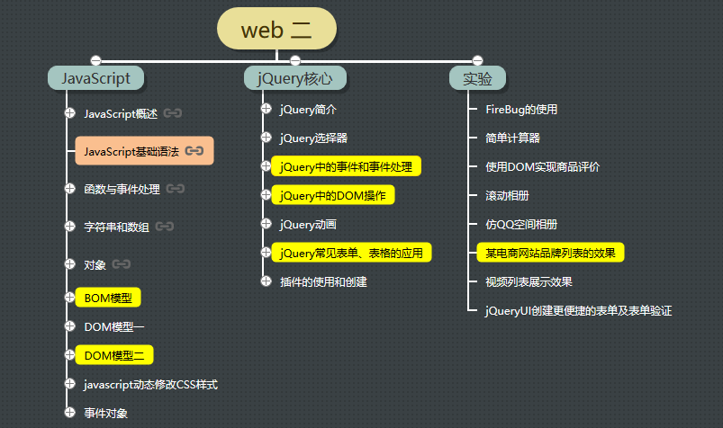

# 1-1 JavaScript 概述

### 课程导入

各位小伙伴，大家好，欢迎收看 web二 系列课程。

web二 是相对于 web一 来说的，他们同属于 web 前端方向的课程体系，我们可以先来看一下课程体系。咱们整个体系一共分为三个阶段，首先第一个阶段就是学习 web一 的课程，web一 的主要内容是 HTML 和 CSS 的基础知识，大家应该在学习 web二 之前已经学习过了。没有学习过的同学请自主学习，内容也不是太复杂难懂。第二个阶段也就是咱们这门课程：web二，主要内容是 JavaScript 和 jQuery 的基础知识。第三个阶段就是提高阶段了，相关的课程有 HTML5，CSS3，前端框架等。

今天是第一节课，废话不多说，我们先来看一下本门课程的课程大纲。  
  
  好，这是我们的课程大纲，从课程大纲我们看到本门课一共有两个大块儿，一个是 JavaScript，一个是 jQuery，JS一共有十章内容，jQuery 一共有七章内容。（PPT翻页）等我们把这些都学了之后，我们就能够使用 JS 实现网页交互或动态效果，能够使用 jQuery 实现网页交互或动态效果。而掌握这些是所有基于web的程序开发基础。所以我们的这门课程既是入门级的，也是必备级的，很重要哦。

### JavaScript 概述

话不多说，开始我们的学习之旅吧，第一章，JavaScript 概述。这一章一共有三个小节的内容，分别是：JavaScript 简介，JavaScript 优缺点，JavaScript 基本用法。下面我们来看JavaScript简介。先相互认识一下，以后才好共事嘛。

（翻页）这是什么？是一个菜单栏和一个下拉菜单。我们写一个页面要用到这三种代码，HTML代码负责我们的页面结构；CSS代码负责页面样式；JavaScript代码负责页面行为，或者说是动态效果。

JavaScript 是一种基于对象和事件驱动并具有安全性能的脚本语言。是一种计算机客户端脚本语言，主要在web浏览器解释执行。注意，JavaScript程序在客户端（浏览器）执行，不需要进行编译。这里还需要说的一点是Java和JavaScript的区别，有的小伙伴可能一听到JavaScript，就会想起Java，可能就又一个疑问，就是JavaScript和Java到底是什么关系呢？那么，下面我就告诉你，JavaScript和Java没有什么关系，除了名字中有几个字是相同的之外没有什么关系，JavaScript之所以叫JavaScript，就是借着当时Java正盛，借其盛名利己推行罢了，就像现在，互联网很火，所以就有了互联网+，互联网加什么什么就可以火，什么是时髦。

下面是一些JavaScript的示例，比如百度首页的“更多产品”的伸缩效果，就是用JavaScript实现的。还有一些比如百度搜索天气的结果效果。还有微博上面的很多效果，地图产品中的一些特效等，很多，现在简直是太常见了啊，都是用JavaScript实现的特效。这里还有一些做的比较好的网站，大家可以自己看一下，我们就不一起看了。（翻页）浏览器中Javascript，用于与用户交互，以及实现页面中各种动态特效。在现代Web应用中，JavaScript无处不在。Javascript是前端开发工程师的必备基础技能。

下面我们来看一下JavaScript这门语言的优缺点。首先从类型来说，JavaScript是动态类型，弱类型的语言，什么是动态类型呢？就是在变量定义时不需要给变量制定数据类型，这就叫做动态类型语言，那大家就知道什么是静态类型的语言了吧？静态类型的语言就是在地鸟滚出变量是必须要给这个变量制定好数据类型。弱类型就是一个类型可以赋不同类型的值，不是固定为某种类型。这应该是它的两个优点，下面还有几个优点：简单性，跨平台性，必要性。。。。下面看它的缺点，怎么这么完美？总的有点儿缺点吧？这就是它的缺点，兼容性差。

前面都是一些表面的了解性的知识，接下来就要上点儿干货了。JavaScript的基本用法。给我们一个东西，我们是不是首先要知道怎么用？咋用？先看一个例子，这个例子是在浏览器中弹出一个提示框。

我们来看一下，JavaScript的用法一共有两种，一种就是内部代码，把JavaScript代码直接写在HTML文件中。第二种是把JavaScript代码写在HTML文件之外的文件中。先看第一种用法，在HTML文件内部的JavaScript代码。需要把这些代码放到一个HTML标签中，``标签。像下面这段代码中一样。那么`<script>`标签放到哪里呢？我们知道在HTML代码中，有些标签放的位置也是有说法的。可以放在....

下面是外部JavaScript文件。

- 外部文件定义为：*.js
- 外部文件可以在html中的head或body中引入
- 一次定义可以重复使用

就像下面这样子.....

在使用外部JavaScript文件时有这么两个注意事项，一个是：外部JavaScript文件中没有`<script>`标签，直接写代码就可以，第二就是：在HTML中，引用外部文件的`<script>`标签中不能写JavaScript代码，若还想在HTML文件中写入JavaScript代码，就要另用一个`<script>`标签。如下面的例子。

JavaScript的开发工具：....

最后给大家推荐几本参考书，大家可以找来看一下。

下面是本章的小结。

***
***

##### 下面是选讲部分，现在只是存储在这儿。

好了,在开始学习新的内容之前,我先得强调一下这门课所讲的内容的重要性.来,复习一个web一中的知识点:基于web的程序,基于web的程序有两种架构,一种是B/S架构,一种是C/S架构.B/S架构也就是基于浏览器运行的程序,而C/S架构师基于特定的客户端运行的程序,这些事之前讲过的内容,大家还有没有印象?下面来看一些例子来帮助大家回忆起来.

B/S架构的实例:腾讯官网,新浪微博,还有咱们校园网的教务系统,是不是都是一些在线的应用?是基于浏览器的?是网页端的.下面看一些C/S架构的应用,这个应该很好举例吧?QQ客户端,微博客户端,还有一些大型的游戏,这些基于客户端的应用都是C/S架构.

而B/S架构又有如下的这些优势,首先它免安装,不用下载客户端到自己的计算机上,抑郁使用个,也正是由于这个特性,它对客户端计算机的配置要求就不高,对吧?不会说你这个电脑配置太低了,所以不能访问我的这个网页,不能通过浏览器登陆我的系统.就算不能登陆那也是浏览器的版本低,而不是我们计算机的配置低.还有什么优势?它的数据都是在服务器端存储的,访问非常的方便,这一点尤其体现在移动办公上,不用说我走到哪儿要背着电脑,我的数据是放在服务器端的,只要你登陆相应的网站或者系统进行访问这些数据就可以了,在线就直接可以调出来.等等,也是基于这些优势,现在越来越多的程序选择使用B/S架构或者推出了B/S架构的版本，就是人家本来是在客户端玩的，但是现在呢也推出了浏览器端的应用。
