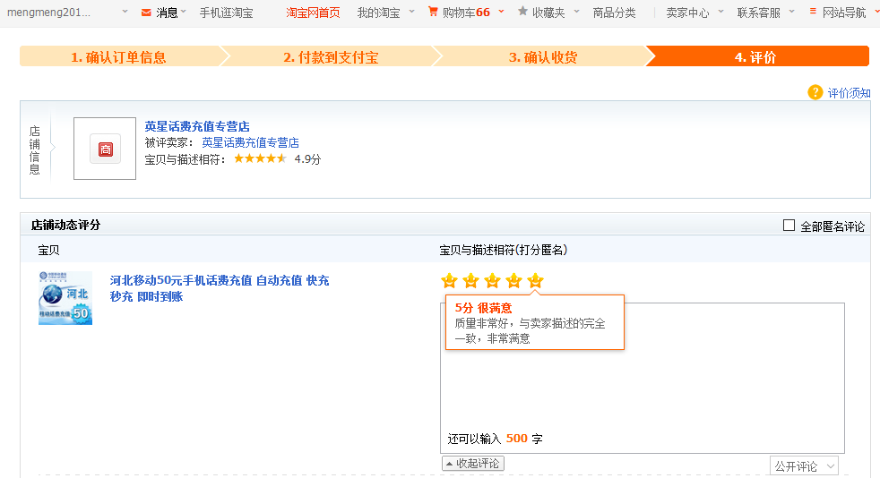

# 实验三、商品评分

### 实验背景

现在是电子商务时代，人们在互联网上购物的行为越来越多，由于网购的商品在购买前无法当面验货，所以大多数人在网购前会查看它的买家使用评价，那么商品的评价是如何实现的呢？如下图是淘宝的评价页面。

### 实验目的

- 掌握分析问题的方法
- 掌握 HTML 代码结构和 CSS 样式的修饰
- 掌握数组的使用
- 掌握 DOM 模型的使用
- 掌握响应事件函数的使用
- 掌握 for 循环的使用

### 实验分析

- 本实验单独抽离出了星级评价和相关评价生成的功能，如下图：

详细从以下几个角度进行分析：
- 创建 html 结构，添加相关的文字，图片和控件；
- 必要的地方使用 CSS 做简单修饰或定位；
- 实现当鼠标经过时，灰色的星星变亮，并显示相应的评论；
- 当鼠标离开时，星星恢复初始的灰色，相应的评论内容也不显示
- 当鼠标点击某个星星时，此星星全变亮，并显示其对应的评价内容，鼠标移开后也没有变化；

### 实验步骤

**步骤一：分析网页结构，写出 HTML 页面**

- 创建 html 结构，包括 5 个星星的 div 以及用于显示相关评价的多行文本域；
- 使用 CSS 对其进行简单修饰；

**步骤二：编写外部 JavaScript 文件**

- 首先将评论问成存储在一个数组中；
- 当鼠标经过时，相应的星星变亮，函数名为starPic()；
- 使用 getElementByTagName() 方法获得每个星星，然后用 for 循环将其之前的星星的 .src 属性替换成 “images/star4.gif”，即使当鼠标滑过一个星星，之前相应的星星由star3.gif 变为 star4.gif,达到的效果就是星星变亮；
- 使用 getElementById() 方法获得显示评论的对象多行文本域，然后将其 value 值替换为当前鼠标所指向的星星对应的评论内容；
- 编辑当鼠标离开时的函数，这里取名为 hide() 函数，在这个函数里首先判断一个全局变量 con 的值是否为 true，con 在之前被赋值为 false，如果 con 的值是true，则返回；如果是 false 则执行 for 循环，将所有的星星的 .src 属性替换为“images/star3.gif”，并将文本域的 value 属性赋值为空；
- 当鼠标点击某个星星时，此星星之前的星星会全变亮，并显示其对应的评论内容，这里为函数取名 gd()，当点击事件触发后，执行此函数，将全局变量 con 设置为 true。
- 写到这里基本的函数写完了，还存在一个如何调用函数的问题，我们可以在每个 img 标签里添加 onmouseover，onmouseout，onclick 这些事件，来调用以上编好的函数；
